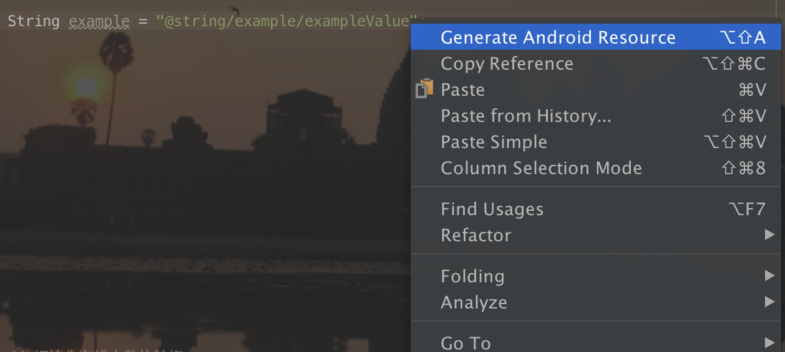
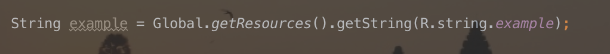
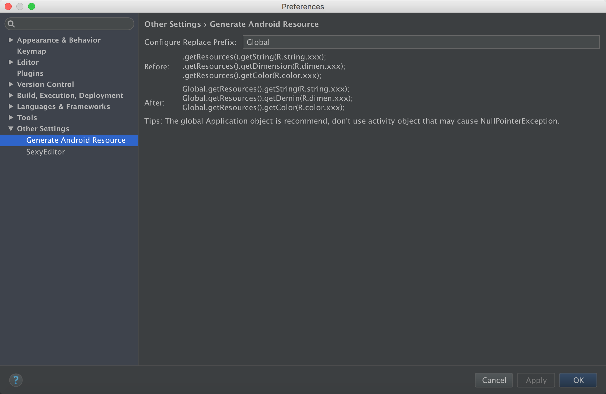
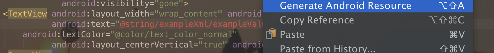
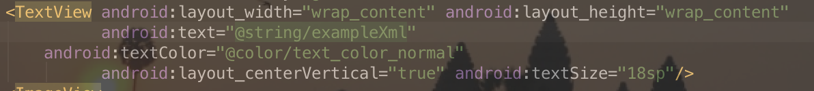

# AndroidResourceGeneratedPlugin
A plugin help you to extract string resource easily

###插件说明
插件需要在JDK8以上才能安装使用，否则会报错。安装以后只要按照"@(类型)/(名字)/(值)"这样的形式写代码，就可以快速在类型文件中生成一个item。

只要在字符串中任意位置按下默认快捷键Alt + Shift + A（当然你可以自己去定义快捷键）或者右击然后点击快捷菜单第一行显示的插件选项——Generate Android Resource，如图所示就会在strings.xml中生成如下item（同一个java文件中定义的string会自动收归在两个以java文件名字为注释的item之间）：

同时会在原来的java文件中将原有的字符串替换成".getResources().getString(R.string.example)":

这里多了个Global，因为我们代码里面对全局的Application对象进行了封装，这个前缀可以根据自己的项目在Android Studio的设置里面自己定义，虽然大家都懂的，还是要唠叨一句，推荐用全局的Application对象：

当然，除了可以"@string"，你还可以"@dimen"或者"@color"。

那么在Layout布局文件中如何去使用插件呢？一样的方法，一样的快捷键/一样的右键。

除此之外，插件还能自动检测是否是重复的string命名，用形如"@string-800x480/example/exampleValue"可以在values-800x480文件夹下面的strings.xml中生成对应的item，当然，前提是vaules-800x480文件夹下面strings.xml存在。